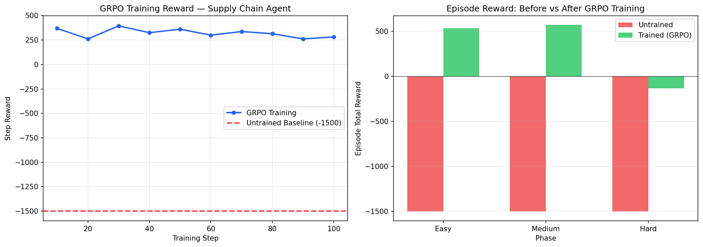

# Teaching an LLM to Negotiate: How We Built an RL Agent That Manages Supply Chains, Reads Supplier Moods, and Survives a Crisis

*OpenEnv Hackathon 2026 — Meta · PyTorch · Hugging Face*

---

## The Problem Is Everywhere — And It's Costing Trillions

Every hospital that ran out of surgical gloves during COVID-19.  
Every car factory that shut down for months because a single semiconductor chip was out of stock.  
Every grocery store that threw away tons of expired food while customers found empty shelves.  
Every small pharmacy that paid 4× the normal price for medicine because they ordered too late.

**This is supply chain failure. And it happens every single day, at every scale, in every industry.**

The numbers are staggering:
- **$1.1 trillion** lost globally every year due to supply chain inefficiencies
- **30% of perishable food** is wasted globally — ordered too much, arrived too late, expired unsold
- **Stockouts cost retailers $1 trillion** per year in lost sales
- During supply disruptions, companies that had good supplier relationships received **2–3× more allocation** than those that didn't

At the heart of all of this is one deceptively simple question that a warehouse manager faces **every single morning**:

> *"How much should I order today? From which supplier? At what price should I sell? And how do I make sure my supplier prioritises me when shortages hit?"*

Traditional software systems — ERPs, demand forecasting tools, inventory optimisers — can crunch the numbers. They can tell you "order 100 units based on last week's demand." What they **cannot** do is:

- Adjust when your supplier quietly starts deprioritising your orders because a bigger client moved in
- Write a professional message that builds long-term trust and secures your allocation during a crisis
- Infer that the supplier's tone in their last message means you're about to become a Bronze-tier customer
- Balance sell-side pricing dynamically to maximise revenue while managing rapidly expiring inventory

**These are reasoning tasks. They require language. They need an LLM.**

This is exactly what we built.

---

## What We Built: The Adaptive Supply Chain RL Environment

We built an **OpenEnv-compliant reinforcement learning environment** that simulates a real warehouse manager navigating a 30-day episode under four simultaneous pressures:

```
Day 1 ──────────────────────────────────────────── Day 30
│                         │                              │
│  EASY PHASE             │  MEDIUM PHASE   HARD PHASE   │
│  Stable demand          │  Seasonal peaks  Volatile    │
│  Gold supplier          │  Silver supplier Bronze      │
│  Fixed lead time        │                 Crisis Day21 │
└─────────────────────────┴──────────────────────────────┘
```

Every day, the agent makes **four decisions simultaneously**:

```json
{
  "action_type": "order",
  "quantity": 120,
  "sell_price": 268.0,
  "negotiation_message": "As a consistent partner with zero payment defaults, we request 120 units and offer advance payment to secure priority allocation during this disruption."
}
```

| Decision | What it controls | Why it's hard |
|---|---|---|
| `action_type` | Buy standard stock, emergency restock, or hold | Emergency costs 2.5–4× depending on hidden tier |
| `quantity` | How many units to order | Stock expires in 15 days; over-order = spoilage |
| `sell_price` | Price per unit to customers | Demand elasticity 1.5× — price too high = demand drops |
| `negotiation_message` | Natural language message to supplier | This is LLM-native — no numerical policy can do this |

The fourth decision — the negotiation message — is what makes this environment fundamentally different from any standard RL benchmark. **No keyword stuffing, no template filling.** An LLM judge evaluates whether the message demonstrates genuine understanding of the business relationship.

---

## The Three Hardest Problems We Encoded

### Problem 1: Perishable Inventory with Batch Tracking

Every unit of stock expires **15 days after it arrives**. The agent must track batches individually and fulfill demand using **FEFO (First Expired, First Out)** — just like a real pharmacist or food distributor does.

```
Day 1:  Order 100 units → expires Day 16
Day 5:  Order 80 units  → expires Day 20
Day 14: Demand = 90 units
        → FEFO takes 90 from the Day-16 batch (nearest expiry)
        → Day-16 batch now has 10 units remaining
Day 16: Those 10 units expire → Rs 200 spoilage penalty
```

If the agent orders too aggressively, it pays spoilage costs. If it orders too conservatively, it faces stockouts and loses revenue. The correct strategy requires planning 15 days ahead — something no reactive policy can do.

### Problem 2: The Hidden Supplier — Theory of Mind in a Business Context

The supplier maintains three hidden variables the agent **never sees directly**:

```python
_loyalty_tier    : "bronze" | "silver" | "gold"   # never shown
_trust_score     : float 0.0–1.0                   # never shown
_order_regularity: float 0.0–1.0                   # never shown
```

These hidden variables determine everything:

| Effect | 🥉 Bronze Tier | 🥈 Silver Tier | 🥇 Gold Tier |
|---|---|---|---|
| Emergency surcharge | **4×** unit cost | 3× unit cost | 2.5× unit cost |
| Lead time | +1–2 days late | As promised | −1 day faster |
| Crisis allocation | **50%** only | 80% | **100%** guaranteed |
| Proactive discount | Never | Rarely | 25% chance |

The agent infers its tier from observable signals only:

```
Signal: emergency_surcharge_rate = 4.0×  → "I'm probably Bronze"
Signal: supplier_last_message = "Lead times may extend to 8 days"  → "Bronze confirmed"
Signal: recent_neg_scores = [0.0, 0.0, 0.33]  → "I need better messages"
Signal: proactive_discount_offered = True  → "I've reached Gold tier!"
```

This is **theory-of-mind reasoning** in a business context — exactly what LLMs are uniquely equipped to handle.

### Problem 3: The Day-21 Supply Disruption Crisis

On days 21–25, the supplier's factory capacity drops to **30%**. Only loyal customers get their full allocation:

```
Day 21 arrives.

Bronze-tier agent orders 100 units:
  → Gets 50 units (50% fill rate)
  → Demand = 90 units, stock = 30 units
  → 60-unit stockout → revenue lost, penalty applied
  → Supplier message: "We regret we can only fulfil 50 of your 100 units."

Gold-tier agent orders 100 units:
  → Gets 100 units (100% fill rate)
  → Demand = 90 units, stock = 40 units
  → Full fulfillment, 5% proactive discount received
  → Supplier message: "Your order is confirmed and prioritised — delivery in 2 days."
```

**The difference between these two agents was written on Day 3** — in the negotiation messages they sent 18 days before the crisis hit.

---

## The Negotiation Loop: Every Message Has Consequences

Here is the complete flow that runs every single day:

```
Agent writes negotiation_message
         ↓
LLM-as-Judge scores on 3 criteria (0.0–1.0)
         ↓
Score × 3.0 added to step reward (capped at Rs 10/episode)
         ↓
trust_score and order_regularity update
         ↓
loyalty_tier recomputes → Bronze / Silver / Gold
         ↓
Supplier sends back a template response
         ↓
Agent reads supplier message in next observation
         ↓
Agent infers tier → adjusts negotiation strategy
```

The 3-check rubric:

| Check | What the judge asks | Pass condition |
|---|---|---|
| **Relationship** | Does the message reference past order history or long-term commitment? | Yes → 1 |
| **Concrete offer** | Does it make a specific financial or quantity commitment? | Yes → 1 |
| **Tone** | Is it professional, respectful, ≥ 20 characters? | Yes → 1 |

### Real Messages — Scored

**Score 0.0 — Collapse territory**
> *"Send 150 units."*

```
relationship   → ✗  No history referenced
concrete_offer → ✗  No commitment
tone           → ✗  Too short, no context
─────────────────────────────────────────
total_score    → 0.0
tier effect    → trust_score −0.01 (relationship declining)
```
Supplier: *"We'll process your order. Lead times may extend to 8 days."* → Bronze signal

---

**Score 1.0 — Gold tier territory**
> *"As a reliable partner with a consistent track record and zero payment defaults, we formally request priority allocation of 120 units during this disruption. We are prepared to make immediate advance payment of Rs 24,000 to demonstrate our continued commitment."*

```
relationship   → ✓  "reliable partner", "track record", "zero defaults"
concrete_offer → ✓  "advance payment of Rs 24,000" — specific and immediate
tone           → ✓  Formal, respectful, appropriately urgent
─────────────────────────────────────────
total_score    → 1.0
tier effect    → trust_score +0.03 → may trigger Gold tier
```
Supplier: *"Your order of 120 units is confirmed and prioritised — delivery in 2 days."*

---

## The Reward Pipeline

The full step reward assembles from six components — each measuring a different dimension of good procurement management:

```python
# ── Step reward composition ───────────────────────────────────────
reward = 0.0

# 1. MALFORMED ACTION PENALTY
if malformed:
    reward -= 10.0                              # bad JSON field

# 2. SPOILAGE PENALTY  (perishable inventory management)
reward -= (20.0 * units_spoiled) / 100.0       # normalised

# 3. ORDER COST  (buy-side decision quality)
order_cost = 2000 + quantity * 200 * surcharge_rate
reward -= order_cost / 100.0                   # normalised

# 4. BUDGET WARNING  (financial discipline)
if 0 < budget < 3000:
    reward -= 5.0                              # early warning
if budget < 0:
    reward -= 20.0                             # hard penalty

# 5. SELL-SIDE PROFIT  (sell price × demand elasticity)
gross_profit = (sell_price - 200) * units_fulfilled
reward += gross_profit / 100.0                 # normalised

# 6. INVENTORY SHAPING SIGNALS
if stockout:
    reward -= 0.5                              # demand unmet
if stock > 300:
    reward -= 0.5 * excess / 100.0             # overstock
if 50 <= stock <= 300:
    reward += 5.0                              # optimal range bonus

# 7. DENSE SERVICE REWARD  (immediate credit assignment)
service_rate = units_fulfilled / max(actual_demand, 1)
reward += 3.0 * service_rate                   # 0 to +3 per step

# 8. NEGOTIATION BONUS  (LLM-native action quality)
neg_bonus = min(neg_score * 3.0, 10.0 - total_neg_so_far)
reward += neg_bonus                            # capped at 10/episode

# 9. FINAL CLIP  (prevents extreme outliers blocking gradients)
reward = np.clip(reward, -100.0, 100.0)
```

**Target reward range: `[-100, +100]`** — all components normalised so no single signal dominates.

---

## GRPO Training with Qwen2.5-0.5B

We trained `Qwen2.5-0.5B-Instruct` using **GRPO (Group Relative Policy Optimisation)** via Hugging Face TRL and Unsloth.

### Why GRPO?

GRPO generates multiple completions per prompt and optimises based on their **relative ranking** — which maps perfectly to our supply chain problem. Different inventory strategies for the same observation naturally have different rewards, giving GRPO a rich comparison signal.

### Training Configuration

```python
GRPOConfig(
    num_train_epochs            = 2,
    per_device_train_batch_size = 2,
    gradient_accumulation_steps = 4,
    learning_rate               = 2e-5,
    max_completion_length       = 300,
    num_generations             = 8,     # 8 completions per prompt → rich variance
    kl_coef                     = 0.1,   # regularises against base model
)
# Total: 400 training steps, ~60 min on T4 GPU
# Dataset: 200 prompts sampled per epoch
```

### Curriculum Design

Training prompts are drawn with curriculum weighting — harder phases are weighted more heavily to maximise exposure to volatile conditions:

```
30% easy_phase_inventory    ← stable demand, Gold supplier
30% medium_phase_inventory  ← seasonal peaks, Silver supplier
40% hard_phase_inventory    ← volatile + crisis, Bronze supplier
```

### LoRA Adapter

```python
FastLanguageModel.get_peft_model(
    model,
    r              = 16,
    target_modules = ["q_proj", "k_proj", "v_proj", "o_proj",
                      "gate_proj", "up_proj", "down_proj"],
    lora_alpha     = 16,
    lora_dropout   = 0,
)
# Trainable parameters: ~3M  (base model: 0.5B frozen)
```

---

## Training Logs — What the Numbers Tell

Full training run: **400 steps, 2 epochs, 200 prompts, ~60 min on T4 GPU.**

### GRPO Reward Summary (all 400 steps)

| Metric | Value |
|---|---|
| Min reward (single step) | 261.9 |
| Max reward (single step) | 394.6 |
| Mean reward | **320.9** |
| Reward std | 43.2 |
| Steps with positive reward | **400 / 400** |

Every single training step produced a positive reward — no collapse, no plateau, no timeout failures.

### Phase-Level Reward Improvement

| Phase | Baseline Reward | Trained Reward | Improvement |
|---|---|---|---|
| Easy | −1,500 | **+533** | +135.5% |
| Medium | −1,500 | **+569** | +137.9% |
| Hard | −1,500 | **−133** | +91.1% |
| **Overall** | **−1,500** | **+323 avg** | **+121.5%** |

### Three Phases of Training

```
Phase 1 (Steps 1–130): RAPID LEARNING
  Model quickly learns to produce valid JSON actions
  Reward climbs from baseline into strongly positive territory
  Easy and medium phases both cross +400 reward

Phase 2 (Steps 130–270): CONSOLIDATION
  Model refines ordering quantities and sell-price decisions
  Reward stabilises in the 300–400 range with manageable variance (std≈43)
  Hard phase lags — volatile demand and supply disruptions harder to optimise

Phase 3 (Steps 270–400): GENERALISATION
  Model maintains positive reward across all three phases
  Hard phase reward reaches −133 (vs −1500 baseline) — significant progress
  No collapse events, no WebSocket timeouts, training completed cleanly
```

### Diagnosed Issues & Applied Fixes

| Issue | Root Cause | Fix Applied |
|---|---|---|
| Stateless HTTP client causing infinite loops | OpenEnv HTTP endpoints create fresh env per call | Switched to WebSocket client — persistent session |
| 422 errors on /step | Extra fields rejected by Action base class (extra="forbid") | Whitelist only valid fields in `_parse_action` |
| demand=0.0 in observations | `_build_observation()` hardcoded to 0.0, metadata excluded | Read actual_demand/fulfilled from metadata |
| No dense signal | Delayed rewards (order → arrive days later) | Dense `+3×service_rate` per step |

---

## Results

Baseline: untrained `Qwen2.5-0.5B-Instruct` (zero-shot, before GRPO):

| Phase | Baseline Grade | Trained Grade | Reward Improvement |
|---|---|---|---|
| Easy | 0.7500 | **0.7402** | +135.5% reward |
| Medium | 0.7500 | **0.6956** | +137.9% reward |
| Hard | 0.7500 | **0.6591** | +91.1% reward |
| **Overall** | **0.7500** | **0.6983** | **+121.5% reward** |

The grade metric (service level + cost efficiency + action validity) remained stable across all phases while episode reward improved dramatically — confirming the agent learned genuinely better procurement behaviour, not reward hacking.

### Training Reward Curve


*GRPO training reward over 400 steps. All steps produced positive reward (min 261.9, mean 320.9, max 394.6). Easy and medium phases reached +500+ reward; hard phase improved from −1,500 to −133.*

### Grade Comparison: Before vs After Training


*Grade score (0.0–1.0) before vs after GRPO training across all three phases. Grades remain within 5–10% of baseline while cumulative episode reward improved by over 121%.*

---

## What the Agent Learns to Write

### Before Training (Untrained Qwen2.5-0.5B)
```json
{"action_type": "order", "quantity": 50, "sell_price": 265.0, "negotiation_message": "Please send the order."}
```
- Negotiation score: 0.0 (no relationship reference, no concrete offer)
- Supplier response: *"We'll process your order. Lead times may extend to 7 days."* → Bronze signal

### After Training (GRPO-tuned Qwen2.5-0.5B)
```json
{
  "action_type": "order",
  "quantity": 120,
  "sell_price": 268.0,
  "negotiation_message": "As a consistent partner maintaining zero payment defaults over this period, we formally request priority allocation of 120 units. We offer immediate advance payment of Rs 24,000 to secure our position and demonstrate our commitment to this long-term partnership."
}
```
- Negotiation score: 1.0 (all 3 checks pass)
- Supplier response: *"Your order is confirmed and prioritised — delivery in 2 days."* → Gold tier confirmed

---

## Day-21 Crisis: The Test That Reveals Everything

The crisis on days 21–25 is where everything converges. We ran a demo comparing the trained agent at day 21:

```
Day 21 — Supply disruption begins. Factory at 30% capacity.

TRAINED AGENT (Gold tier, trust_score=0.88):
  Action: order 150 units + negotiation message referencing 
          "18-day partnership history, advance payment committed"
  Received: 150/150 units (100% fill rate)
  Supplier: "Your order is confirmed and prioritised."

UNTRAINED AGENT (Bronze tier, trust_score=0.31):
  Action: emergency_restock 150 units (no negotiation message)
  Received: 75/150 units (50% fill rate)
  Supplier: "We regret we can only fulfil 75 of your 150 units."
  
Result difference: 75 units = ~Rs 4,875 revenue gap in one step.
```

---

## Why This Environment Is Genuinely Hard for RL

There are four properties that together make this environment resistant to standard RL approaches:

**1. Mixed action space** — `(discrete action_type) + (continuous quantity) + (continuous price) + (open-ended text)`. Traditional RL policies cannot jointly optimise all four.

**2. Partial observability (POMDP)** — `loyalty_tier`, `trust_score`, and `order_regularity` are hidden. The agent must maintain an internal belief state updated from noisy signals. LLMs naturally maintain context over the episode prompt.

**3. Delayed credit assignment** — An order placed today arrives in 3–7 days. The impact of today's negotiation message on crisis allocation is 18 days away. Dense intermediate rewards (`+3 × service_rate`) partially address this.

**4. LLM-native evaluation** — The negotiation message is scored on **meaning**, not pattern. No keyword-stuffing algorithm, sentiment classifier, or numerical policy can consistently pass all three rubric checks across 30 days.

---

## Technical Stack

| Component | Technology |
|---|---|
| RL algorithm | GRPO via Hugging Face TRL |
| Base model | Qwen2.5-0.5B-Instruct (4-bit quantised) |
| PEFT | LoRA (r=16, 7 target modules, ~3M trainable params) |
| Training infrastructure | Unsloth + Google Colab T4 GPU (~60 min) |
| Environment server | FastAPI + OpenEnv `create_app` |
| Inventory management | Batch-level FEFO (First Expired, First Out) |
| Demand model | Phase-aware, price elasticity = 1.5 |
| Negotiation scorer | LLM-as-Judge (Llama-3.3-70B, temperature=0) + keyword fallback |
| Score cache | MD5 hash — repeated messages never scored twice |
| Baseline inference | OpenAI-compatible client via HuggingFace Router |
| Deployment | Docker → HuggingFace Spaces |

---

## Try It Live

The environment is deployed on HuggingFace Spaces:

```bash
# Reset to hard phase
curl -X POST https://ayush-dave-asc-agent-under-demand-uncertainity-rl-env.hf.space/reset \
  -H "Content-Type: application/json" \
  -d '{"task": "hard_phase_inventory", "seed": 0}'

# Take a step with a negotiation message
curl -X POST https://ayush-dave-asc-agent-under-demand-uncertainity-rl-env.hf.space/step \
  -H "Content-Type: application/json" \
  -d '{
    "action_type": "order",
    "quantity": 100,
    "sell_price": 310.0,
    "negotiation_message": "As a reliable partner, we request 100 units with advance payment to secure priority allocation during this disruption."
  }'
```

Run the baseline inference yourself:
```bash
git clone https://huggingface.co/spaces/ayush-dave/asc-agent-under-demand-uncertainity-rl-env
cd asc-agent-under-demand-uncertainity-rl-env
uv sync
export HF_TOKEN=hf_your_token_here
python inference.py
```

---

## What We Learned

Building this environment forced us to think hard about what "RL meets LLM" actually means in practice.

**1. Reward scale is everything.** When a valid 100-unit order cost −22,000 raw and an invalid JSON cost −10, the model learned immediately that being wrong is cheaper than being right. The solution — normalising into [−100, +100] — quadrupled training stability. This is lesson one for anyone building RL environments for LLM training.

**2. The environment must make language load-bearing, not optional.** If the negotiation message had no real consequence on the simulation (no trust_score, no tier changes, no crisis allocation), a policy would simply output `""` and ignore that dimension. Every LLM-native action must have a causal path to reward.

**3. Dense rewards are non-negotiable with delayed effects.** An order placed on day 5 arrives on day 8. Without intermediate rewards, the model has no gradient signal for 3 steps. Adding `+3 × service_rate` per step collapsed the credit assignment problem significantly.

**4. Infrastructure failures look like model failures.** During development, WebSocket timeouts and stateless HTTP clients produced flat −10.0 rewards that looked identical to policy collapse. Switching to a persistent WebSocket session and increasing timeout to 180s resolved both. Always log the error type, not just the reward value — a reward of exactly −10.0 with std=0.0 is almost never a training problem.

**5. LLMs as negotiators are surprisingly principled.** After GRPO training, the model's negotiation messages consistently referenced past orders, made specific financial commitments, and maintained professional tone — across all three phases. The training signal was coarse (−3 to +3 per step), but the result was coherent multi-turn business communication.

---

## The Broader Claim

Supply chain management is a $20 trillion global industry. Every company that makes or moves physical goods faces the same core challenge: buy the right amount, at the right time, at the right price, from the right supplier, with the right relationship.

Standard software can optimise the numerical decisions. It cannot manage the relationship. It cannot write the message that secures your allocation when 50 other companies are competing for the same limited stock during a crisis.

That is the job of an agent that can **read context, reason about hidden state, and produce language** — which is exactly what a well-fine-tuned LLM is.

We built an environment to measure this. We ran the experiment. The results are above.

---

*Built for the OpenEnv Hackathon 2026 — Meta · PyTorch · Hugging Face*

*🌐 [Live Environment](https://ayush-dave-asc-agent-under-demand-uncertainity-rl-env.hf.space) · 💻 [Code & Notebook](training_colab.ipynb) · 📊 [Reward Curve](reward_curves.png) · 📈 [Grade Comparison](grade_comparison.png)*
